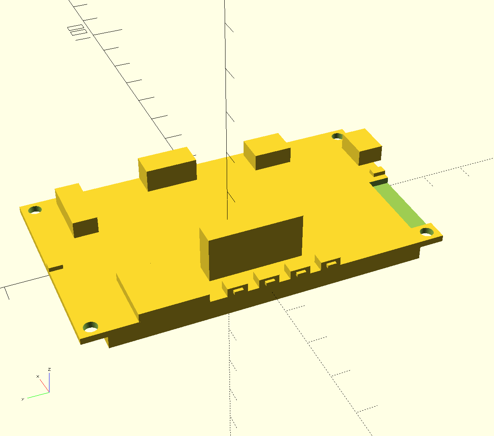

# ttgo_t5s_esp32

This is a small collection of my code for the IMHO excellent TTGO T5S board.

The board is a 2.7" WBR ePaper display, with an ESP32 MCU mounted to the back along with some IO and support circuitry.

See https://www.aliexpress.com/item/TTGO-T5s-V1-9-ESP32-2-7-EPaper-module-for-Alexa-I2S-DAC-MAX98357A-MEMS-microphone/32896563518.html for more details

## Feature list (from above web site)

* Lastest ESP32 Version: REV1
* 2.7″ePaper board consisting of ESP32-D0WDQ6, I2S DAC MAX98357A, and two pcs I2S MEMS microphone ICS43434
* Single channel, Class-D amplifier embedded DAC, MAX98357 is connected to ESP32 through I2S bus.
* MEMS microphone Invensense ICS-43434 is connected to ESP32 through I2S bus.
* On-board USB-UART interface (CP2102) with several glue logic for direct binary uploading.
* WIFI
* Bluetooth
* 4 MB Flash
* 3D ANTENNA
* 2A Battery Management
* LED indicator: There are 4 LEDs show the battery status in real time.
* Power button: Click one time will start. Fast click 2 times will shut down.
* 2.7″ ePaper module 264*176 pixels,
* TFCARD
* Protection: Short protection. Over charging protection. Overflowing
* Three buttons (IO34, IO35, IO39)
* Reset button

# OpenSCAD Models

The [OpenSCAD file](openscad/ttgo_t5s.scad) contains a (rough, wip) model of the approximate dimensions I built to help me verify the case design will fit properly.

